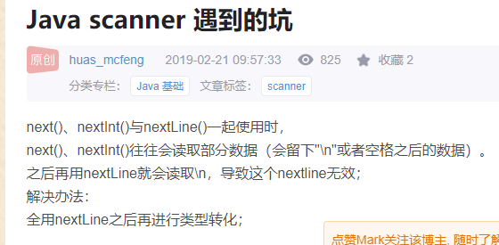

# Scanner
> java 内置的工具类 <br/>
> 用于监听用户在控制台的输入

## 使用
```java
import java.util.Scanner;

public class Example {
  public static void main(String[] args){
    Scanner scanner = new Scanner(System.in);
    
    // 程序走到这一步会因为 hasNextDouble 卡住
    // 等待控制台用户输入
    // 判断输入的是否为 double 类型
    // 只有类型匹配，才会继续执行
    // hasNext 还有其他类型的方法（hasNextInt 等）
    if (scanner.hasNextDouble()) {
      // nextDouble 方法用于获取用户的输入
      // 相同于 hasNext 系列方法，也有其他类型的方法（nextInt 等）
      System.out.println(scanner.nextDouble());      
    }

    scanner.close();
  }
}
```

## 坑
